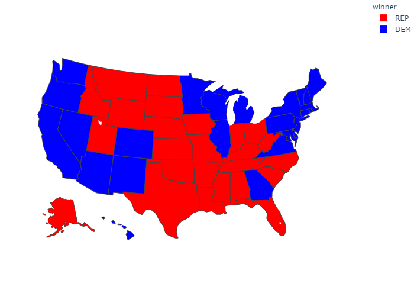
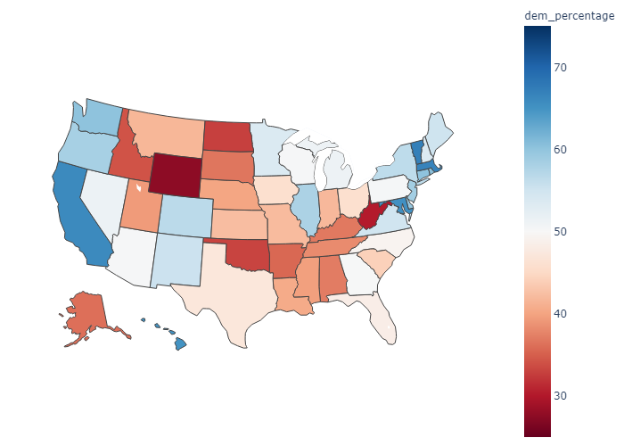
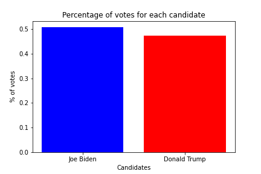

# US-Election-Visualization

Why just look at nice visualizations of the 2020 US election results, if you can rebuild them on your own?
I wanted to combine my interest for politics as well as my abilities to process data by visualizing the votes. 

The visualization uses the following data set: https://www.kaggle.com/unanimad/us-election-2020

To see the **full notebook with all outputs**, visit this link: https://www.kaggle.com/frankjonasmoelle/election-visualization

**Visualizing the winner of the election for each state:**

**Visualizing percentage of votes for the democratic/republican party for each state:**

**The total votes and their percentages for Biden and Trump:**

